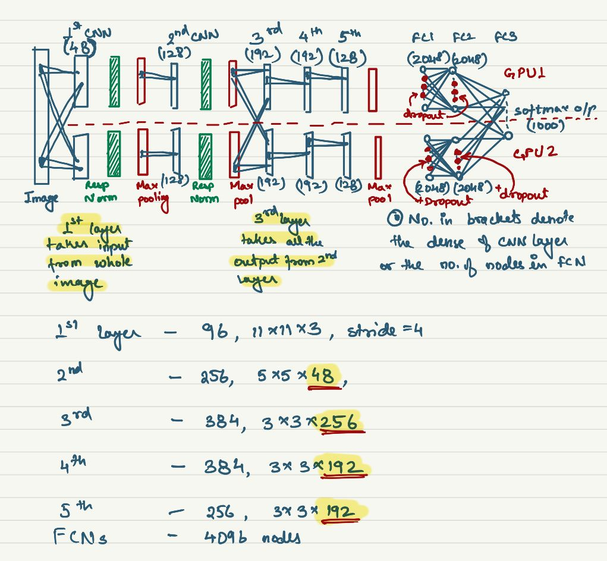

# ImageNet Classification with Deep Convolution Neural Networks

Authors:

- **Alex Krizhevsky**
- **Ilya Sutskever**
- **Geoffrey E. Hinton**

<b>Year of Release: 2010</b>

## What does this Paper talk about?

This paper proposes a model which can be used for object classification using deep neural convolution network.

## What was done differently

Certain things that was differently compared to previous models was:

- Used `Dropout` regularization, for regularization
- Used `Non-Saturating` neurons i.e. used ReLU activation function
- Used `Local Response Normalization`
- GPU implementation of convolution operation i.e. used 2 GPU and divided the network in half to carry on the operations in each GPU parallely

## The Dataset

It is a subset of the ImageNet dataset. All the images in the dataset has been down sampled into 256x256 images.

There are 1.2 million training images, 50,000 validation images and 150,000 testing images.

## The Architecture Modules

The architecture uses some uncommon ways for the first time. These are the use of 

- ReLU activation function

- 2 Parallel GPU implementation rather than fitting the whole network in 1 GPU

- Local Response Normlization

- Overlapping Pooling i.e. stride is less than the filter size

- Dropout

### ReLU Activation Function

This was used in place of using the `tanh` function because ReLU gave a faster result than its counterpart.

> **Proof:** They tested ReLU vs Tanh on a CIFAR-10 dataset and found that ReLU reached the 25% training error rate 6 times faster than Tanh.

As a result all neurons(except the final layer) uses ReLU activation function.

### Multiple GPU implementation

2 Nvidia GTX 580 3GB GPU were used. This was done because the GPUs had a faster way to read and write to one others memory directly without going through the host machine memory. 

Another thing that was implemented is that all the layers didnt have access to all the output from the previous layers. Most layers could only use the ouput that was present in the same GPU's memory and didnt access the data in the other GPU's memory. Thus communication between layers were hindered.

> This gave the architecture the appearance of a `columnar` CNN.

> This in result reduced the Top1% and Top5% error rate by 1.7% and 1.2% respectively.

### Local Response Normalization

This is done to aid more generalization i.e. reduce overfitting. 

> This can also be looked up as a "brightness normalization" i.e. the intensity of the output is reduced by a factor.

In simple terms here the output feature map i.e. the the value obtained after applying the activation function is normalized with the help of the adjacent activation values. Thus the overall activation of a kernel i.e. the output of the layer reduces in value rather than shooting up.****

> **Proof:** This scheme was tested on CIFAR-10 dataset and a 4 layer CNN achieved a 13% test error rate without normalization where as it achieved 11% with normalization.

This method introduces 4 hyper-parameters than can be adjusted to get the best results. These hyperparameters are: 

- $k$ 

- $\alpha$

- $\beta$

- $n$

> Response normalization reduces the Top1% and Top5% error rates by 1.4% and 1.2% respectively.

### Overlapping Max Pooling

It was observed that overlapping pooling when used, the model was a bit more difficult to overfit compared to non overlapping pooling model.

> Overlapping pooling reduces the overall Top1% and Top5% error rates by 0.4% and 0.3% respectively.

### Dropout

The regularization concept of Dropout was also used in this model. Here the hyper-parameter was set to 0.5 i.e. 50% of the nodes in the fully connected hidden layers will be dropped during the forward pass and those nodes wont be updated during the backward propagation.

> The main reason to use this technique was to reduce co-adaptation of the nodes on each other and so that the neurons rely less on the presence of a particular other neuron and learns more robust features to identify a feature.

## Final Architecture

The Final architecture is as follows:

- Input: a 256x256x3 RGB image

- Layer 1:
  
     - CNN Layer
  
     - Total of 96 Kernels, divided equally in 2 GPUs i.e. each GPU has 48 kernels
  
     - each 48 kernels in each GPU takes the whole image as input
  
     - kernel size: 11x11x3
  
     - Stride: 4 i.e. overlapping convolution
  
     - **Response Normalization applied post activation function**
  
     - **Max Pooling applied post response normalization operation**

- Layer 2:
  
     - CNN Layer
  
     - Total of 256 Kernels divided equally in 2 GPUs i.e. each GPU has 128 Kernels
  
     - 128 Kernels in each GPU **takes only the 48 kernel in their own GPU from layer 1 as input**
  
     - Kernel size: 5x5x48
  
     - **Response Normalization applied post activation function**
  
     - **Max Pooling applied post response normalization operation**

- Layer 3:
  
     - CNN Layer
  
     - Total of 384 Kernels divided equally in 2 GPUs i.e. each GPU has 192 Kernels
  
     - 192 Kernels in each GPU **takes the whole layer 2 from both the GPUs  as input**
  
     - Kernel size: 3x3x256

- Layer 4:
  
     - CNN Layer
  
     - Total of 384 Kernels divided equally in 2 GPUs i.e. each GPU has 192 Kernels
  
     - 192 Kernels in each GPU **takes only the 192 kernel in their own GPU from layer 3 as input**
  
     - Kernel size: 3x3x192

- Layer 5:
  
     - CNN Layer
  
     - Total of 256 Kernels divided equally in 2 GPUs i.e. each GPU has 128 Kernels
  
     - 128 Kernels in each GPU **takes only the 192 kernel in their own GPU from layer 4 as input**
  
     - Kernel size: 3x3x192
  
     - **Max Pooling applied post applying of activation function**

- Layer 6:
  
     - Fully Connected Layer
  
     - Total of 4096 nodes divided equally in 2 GPUs i.e. each GPU has 2048 nodes
  
     - 1024 nodes in each GPU **takes only the 128 kernel output in their own GPU from layer 5 as input**
  
     - **Dropout also used in this layer with 0.5 proability**

- Layer 7:
  
     - Fully Connected Layer
  
     - Total of 4096 nodes divided equally in 2 GPUs i.e. each GPU has 2048 nodes
  
     - 1024 nodes in each GPU **takes only the 2048 nodes in their own GPU from layer 6 as input**
  
     - **Dropout also used in this layer with 0.5 proability**

- Layer 8:
  
     - Fully Connected Layer
  
     - Total of 1000 nodes
  
     - Softmax activation function is used
  
     - It takes all the nodes from the layer 7, from both the GPUs as input.

#### Points to Remember:

- Response normalization is used only with layer 1 and 2

- Max Pooling layer is only used layer 1, 2 and 5

- All the layers from 1 to 7 are divided into 2 GPUs

- Only 1st, 3rd, and 8th layer accept inputs from the whole output of previous layer

- Dropout used for all hidden fully connected layer

- All layers use ReLU activation

## Model Training

### Data Pre-processing

2 types of data augmentation is used.

#### Basic image manipulation

In this type of augmentation we try to create extra images from the given set of images by horizontally flipping it.

#### Altering RGB of images

In this form of image augmentation, they performed PCA on the set of RGB pixel values throughout the ImageNet training set. To each training image, they added multiplies of the the principal components with magnitudes corresponding to the respective eigenvalues times a random variable drawn from a Gaussian with mean 0 and standard deviation 0.1. 

> This was done because of the simple property of the images i.e. changing the intensity and color of illumination doesn't change the object's identity.

> This improved the top1% error rate by over 1%

## Weight Intitalization

The weights of each layer has been initialized by sample values from a Gaussian distribution of mean 0 and standard deviation of 0.1.

The biases of 2nd, 4th and 5th CNN and all the fully connected layers have been initialized with constant 1. This accelerated the early stages of learning by providing ReLU with positive inputs.

Other layer's biases has been initialized with 0.

### Training

The initial learning rate was chosen 0.1. The learning rate was divided by 10 whenever the validation error rate stopped improving. 90 epochs were used for the training. A total of 3 times, the learning rate was reduced by the factor of 10.
